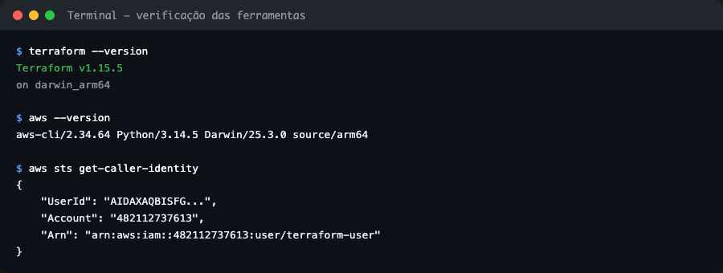
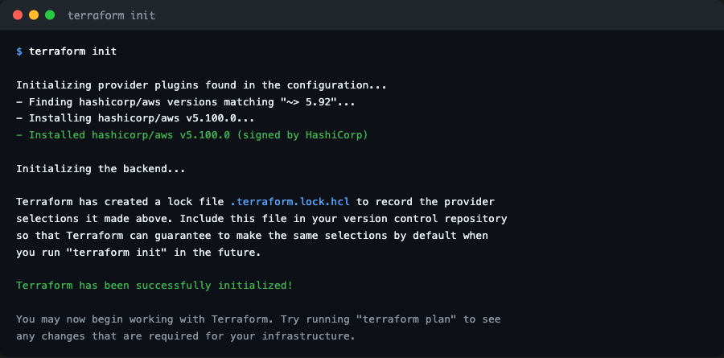
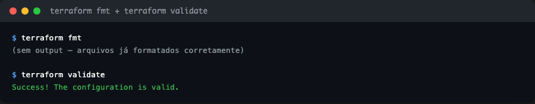
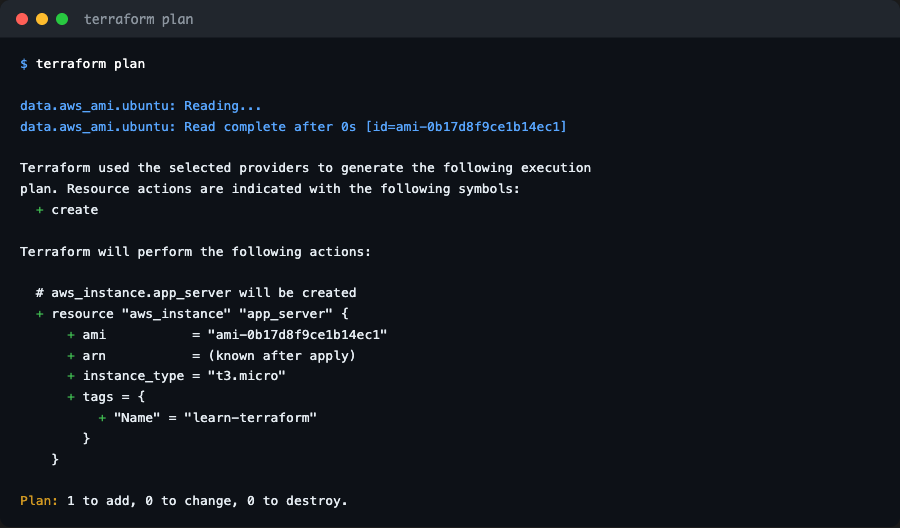
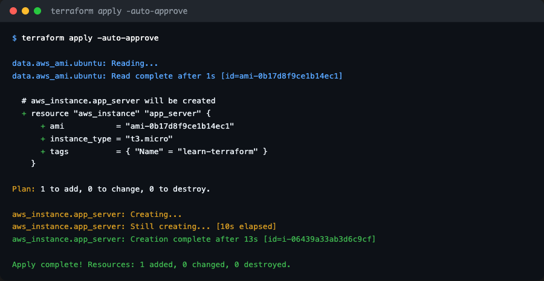
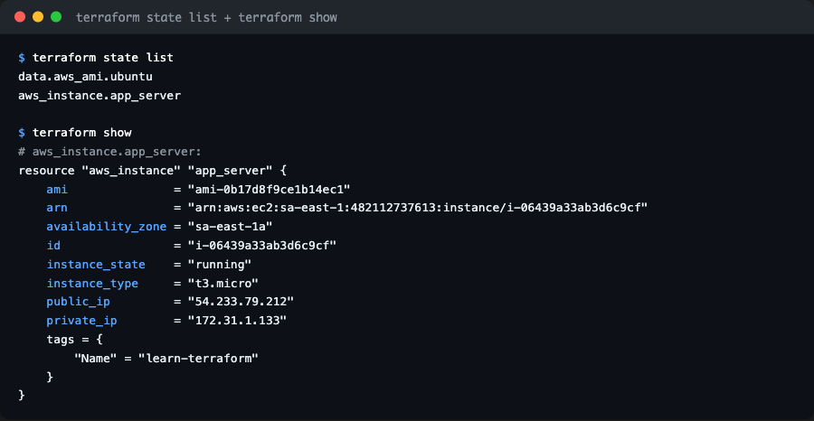
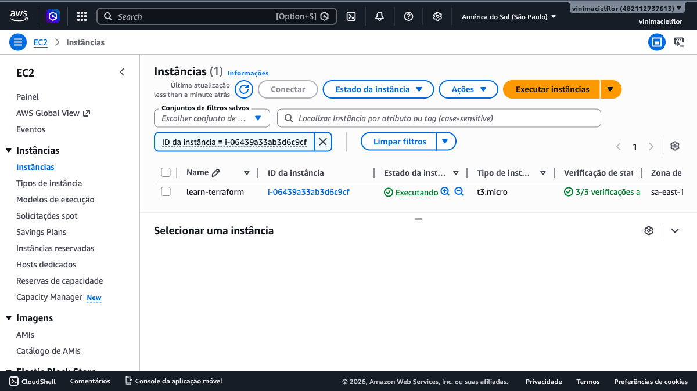
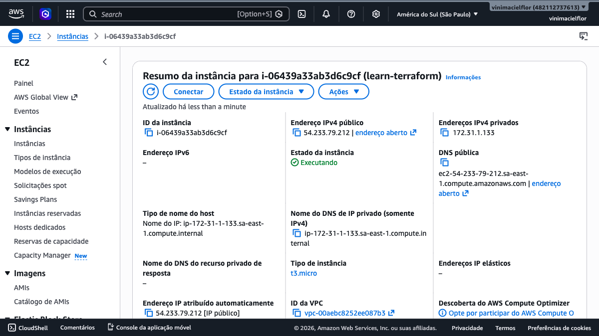
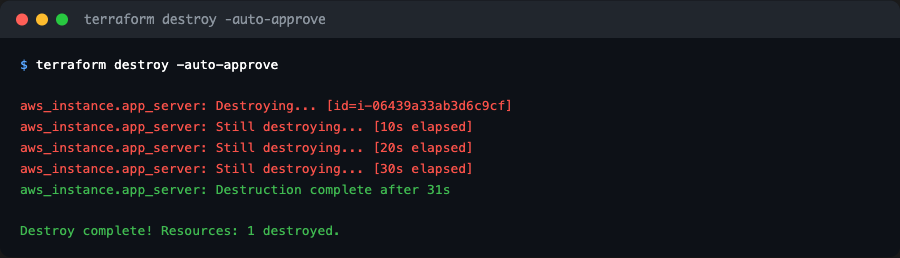

# Terraform AWS — Infraestrutura como Código

Atividade prática seguindo o [tutorial oficial da HashiCorp](https://developer.hashicorp.com/terraform/tutorials/aws-get-started/aws-create) para provisionar uma instância EC2 na AWS usando Terraform. O objetivo é entender na prática como IaC funciona: escrever a infraestrutura em código, versionar, e conseguir recriar o ambiente de forma consistente.

---

## Pré-requisitos

- Terraform CLI 1.2+
- AWS CLI 2.x
- Conta AWS com um IAM User com permissão `AmazonEC2FullAccess`
- macOS com Homebrew instalado

> **Atenção:** nunca use as credenciais da conta root da AWS para acesso programático. Crie um IAM User dedicado.

---

## Instalação

O Terraform saiu do repositório padrão do Homebrew, então é preciso adicionar o tap da HashiCorp antes de instalar:

```bash
brew tap hashicorp/tap
brew install hashicorp/tap/terraform awscli
```

Depois de instalar, verifiquei que tudo estava funcionando:



---

## Configurando as credenciais AWS

Primeiro criei um IAM User no console da AWS em **IAM → Users → Create user**, com a permissão `AmazonEC2FullAccess` e gerei uma Access Key para uso no terminal.

Depois configurei localmente:

```bash
aws configure
```

Preenchi com o Access Key ID, Secret Access Key, região `sa-east-1` e formato de saída `json`. Para confirmar que estava autenticado corretamente, rodei `aws sts get-caller-identity` e o retorno mostrou o ARN do usuário `terraform-user`.

---

## Estrutura dos arquivos

O projeto tem dois arquivos principais:

**`terraform.tf`** — declara qual versão do Terraform e do provider AWS são necessários:

```hcl
terraform {
  required_providers {
    aws = {
      source  = "hashicorp/aws"
      version = "~> 5.92"
    }
  }
  required_version = ">= 1.2"
}
```

**`main.tf`** — configura o provider, busca a AMI do Ubuntu mais recente de forma dinâmica (sem hardcoded) e define a instância EC2:

```hcl
provider "aws" {
  region = "sa-east-1"
}

data "aws_ami" "ubuntu" {
  most_recent = true

  filter {
    name   = "name"
    values = ["ubuntu/images/hvm-ssd-gp3/ubuntu-noble-24.04-amd64-server-*"]
  }

  owners = ["099720109477"] # Canonical
}

resource "aws_instance" "app_server" {
  ami           = data.aws_ami.ubuntu.id
  instance_type = "t3.micro"

  tags = {
    Name = "learn-terraform"
  }
}
```

> **Observação:** o tutorial usa `t2.micro`, mas na região `sa-east-1` (São Paulo) esse tipo não é elegível para o Free Tier. Rodei `aws ec2 describe-instance-types --filters "Name=free-tier-eligible,Values=true"` para descobrir que o tipo correto para essa região é `t3.micro`.

---

## terraform init

O primeiro comando a rodar é o `terraform init`. Ele inicializa o diretório de trabalho e faz o download do provider AWS:

```bash
terraform init
```



O Terraform baixou o provider `hashicorp/aws v5.100.0` e criou o arquivo `.terraform.lock.hcl` para fixar a versão usada.

---

## terraform fmt e terraform validate

Antes de aplicar, é boa prática formatar o código e validar a configuração:

```bash
terraform fmt
terraform validate
```



O `fmt` não retornou nada porque os arquivos já estavam no formato correto. O `validate` confirmou que a configuração é válida.

---

## terraform plan

O `plan` mostra exatamente o que o Terraform vai criar, modificar ou destruir — sem fazer nada ainda. É útil para revisar antes de aplicar:

```bash
terraform plan
```



O data source `aws_ami` já buscou a AMI mais recente do Ubuntu 24.04 disponível em `sa-east-1` (`ami-0b17d8f9ce1b14ec1`). O plano mostra `1 to add, 0 to change, 0 to destroy`.

---

## terraform apply

O `apply` executa o plano e cria os recursos na AWS:

```bash
terraform apply -auto-approve
```



A instância foi criada em 13 segundos com o ID `i-06439a33ab3d6c9cf`.

---

## Inspecionando o estado

O Terraform guarda o estado da infraestrutura localmente no `terraform.tfstate`. Para consultar o que está sendo gerenciado:

```bash
terraform state list
terraform show
```



O `state list` retorna os dois recursos: o data source da AMI e a instância EC2. O `show` exibe todos os atributos da instância, incluindo IP público, DNS, availability zone e estado.

---

## Recursos provisionados na AWS

Abaixo estão os prints do console da AWS comprovando a instância criada:

**Lista de instâncias EC2 na região sa-east-1 (São Paulo):**



**Detalhes da instância `learn-terraform`:**



| Campo | Valor |
|---|---|
| Instance ID | `i-06439a33ab3d6c9cf` |
| Tipo | `t3.micro` |
| AMI | `ami-0b17d8f9ce1b14ec1` — Ubuntu 24.04 LTS |
| Região | `sa-east-1` — América do Sul (São Paulo) |
| Availability Zone | `sa-east-1a` |
| IP Público | `54.233.79.212` |
| IP Privado | `172.31.1.133` |
| Estado | `running` |

---

## terraform destroy

Após finalizar a atividade, destruí a infraestrutura para evitar cobranças:

```bash
terraform destroy -auto-approve
```



A instância foi terminada em 31 segundos. O Terraform zerou o estado — `0 to add, 0 to change, 1 to destroy`.

---

## Referências

- [HashiCorp — Get Started AWS](https://developer.hashicorp.com/terraform/tutorials/aws-get-started/aws-create)
- [Terraform AWS Provider](https://registry.terraform.io/providers/hashicorp/aws/latest/docs)
- [AWS Free Tier](https://aws.amazon.com/free/)
